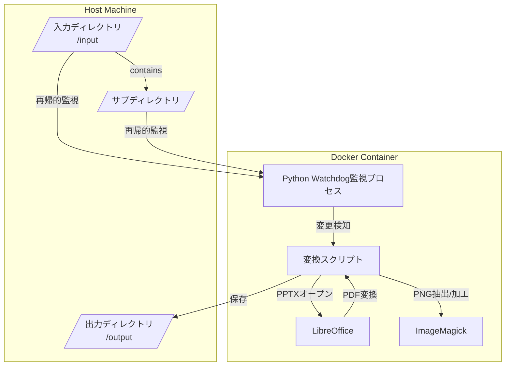
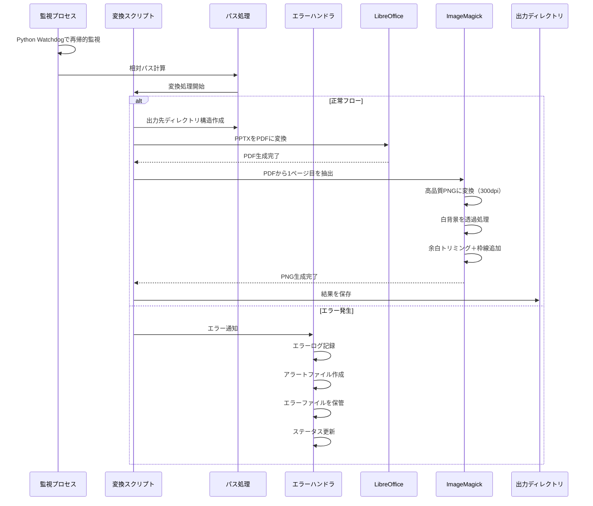

# PPTXファイル監視・変換システム 実装計画

## 1. システム構成図



## 2. 監視対象の定義

### ディレクトリ監視設定
- ベースディレクトリ: `/app/input`
- 監視方式: Python Watchdogによる再帰的監視
- イベントバッファリング: 同一ファイルの連続イベントを集約（0.1秒）

### ファイルパターン
- 拡張子: `.pptx`のみ（大文字小文字を区別しない）
- ファイルサイズ制限: 100MB以下
- 除外パターン:
  - `~$`で始まる一時ファイル
  - `.#`で始まるバックアップファイル
  - `._`で始まるmacOSのメタデータファイル

### ファイル処理の制御
- クールダウン期間: 同一ファイルの処理間隔を2秒以上に制限
- イベントバッファリング:
  - 連続イベントを0.1秒間バッファリング
  - 複数回の更新を1回の処理にまとめる
- 重複処理防止:
  - ファイル内容のMD5ハッシュを計算
  - 前回処理時と同じハッシュの場合は処理をスキップ

### 監視イベント
- CREATE: 新規ファイル作成を検知
- MODIFY: 既存ファイル更新を検知
- MOVED_TO:
  - 監視対象ディレクトリへのファイル移動
  - 監視対象ディレクトリ内でのファイル移動/リネーム
- イベント処理:
  - イベントの種類に関係なく同一のバッファリングロジックを適用
  - 連続したイベントは最後の1回のみ処理

### 出力ディレクトリ構造の維持
- 入力ディレクトリの構造を出力側でも維持
- 例：
  ```
  入力: /app/input/dir1/dir2/example.pptx
  出力: /app/output/dir1/dir2/example.png
  ```

## 3. エラー通知・ハンドリング

### エラー種別と対応
1. 入力ファイルエラー
   - ファイル形式不正
   - ファイルサイズ超過（上限: 100MB）
   - ファイルアクセス権限エラー
   → エラーログ出力＋エラーファイルを専用ディレクトリに移動

2. 変換処理エラー
   - LibreOffice変換エラー (PDF変換失敗)
   - ImageMagick処理エラー (PNG変換・透過処理失敗)
   → エラーログ出力＋エラーファイルの保存

3. 出力エラー
   - ディスク容量不足
   - 権限エラー
   - サブディレクトリ作成エラー
   → エラーログ出力＋アラートファイル作成

### ログ形式
```json
{
  "timestamp": "2024-05-21T22:10:31+09:00",
  "level": "ERROR",
  "event": "conversion_failed",
  "file": "dir1/dir2/example.pptx",
  "error": "PDF conversion failed",
  "details": {
    "input_path": "/app/input/dir1/dir2",
    "output_path": "/app/output/dir1/dir2"
    "input_path": "/app/input/dir1/dir2",
    "output_path": "/app/output/dir1/dir2"
  }
}
```

### エラー通知方法
1. エラーログファイル
   - 保存先: `/app/logs/error.log`
   - ローテーション: 日次＋最大7日分保持

2. アラートファイル
   - 保存先: `/app/output/.alerts/`
   - 命名規則: `{相対パス}/{元ファイル名}.error`
   - 内容: JSON形式でエラー詳細を保存

3. ステータスファイル
   - 保存先: `/app/status/status.json`
   - 更新頻度: エラー発生時即時更新
   - 内容: 現在の処理状態、最後のエラー情報等

## 4. 実装ファイル構成

```plaintext
/app/
  ├── scripts/
  │   ├── watch.py        # 監視スクリプト（Python Watchdog使用）
  │   ├── convert.sh      # 変換スクリプト
  │   └── error_handle.sh # エラーハンドリングスクリプト
  ├── input/              # 入力用volumeマウントポイント
  │   └── **/*.pptx      # 任意の深さのサブディレクトリ
  ├── output/             # 出力用volumeマウントポイント
  │   └── .alerts/        # エラー通知用ディレクトリ
  ├── logs/               # ログディレクトリ
  ├── status/             # ステータス管理ディレクトリ
  └── error_files/        # エラーファイル移動先
      └── YYYY-MM-DD/     # 日付ごとのディレクトリ
```

## 5. 処理フロー



## 6. 次のステップ

1. ✅ Dockerfileの作成
2. ✅ Python Watchdogによる再帰的監視の実装
3. ✅ 変換スクリプトの実装
4. ✅ エラーハンドリングの実装
6. ✅ テスト環境の整備
   - テスト用入力ディレクトリの構築
   - テストデータ（PPTXファイル）の用意

7. テストケースの実行と確認
   - ディレクトリ構造の異なるパターン
   - 深いネストしたディレクトリ
   - 同時に複数ファイルの更新
   - 非対応ファイル形式の除外
   - エラーハンドリングの動作
   - ファイルサイズ制限の確認

8. 監視プロセスの最適化
   - イベントバッファリングの調整
   - クールダウン期間の設定
   - ファイルハッシュによる重複処理防止

9. デプロイメント・運用手順の整備
   - 環境構築手順の文書化
   - トラブルシューティングガイドの作成
   - 監視・メンテナンス手順の策定